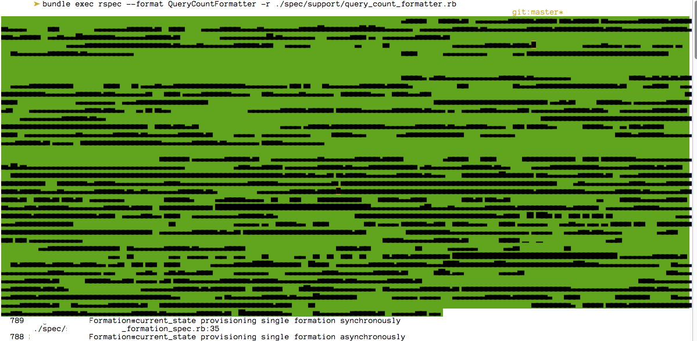

# sequel-rspec-query-count-formatter

Counts how many sql queries each example uses

Usage:

    bundle exec rspec --format QueryCountFormatter -r ./spec/support/query_count_formatter.rb spec
    bundle exec rspec --format QueryCountFormatter -r ./spec/support/query_count_formatter.rb spec/path/to/specific/spec

